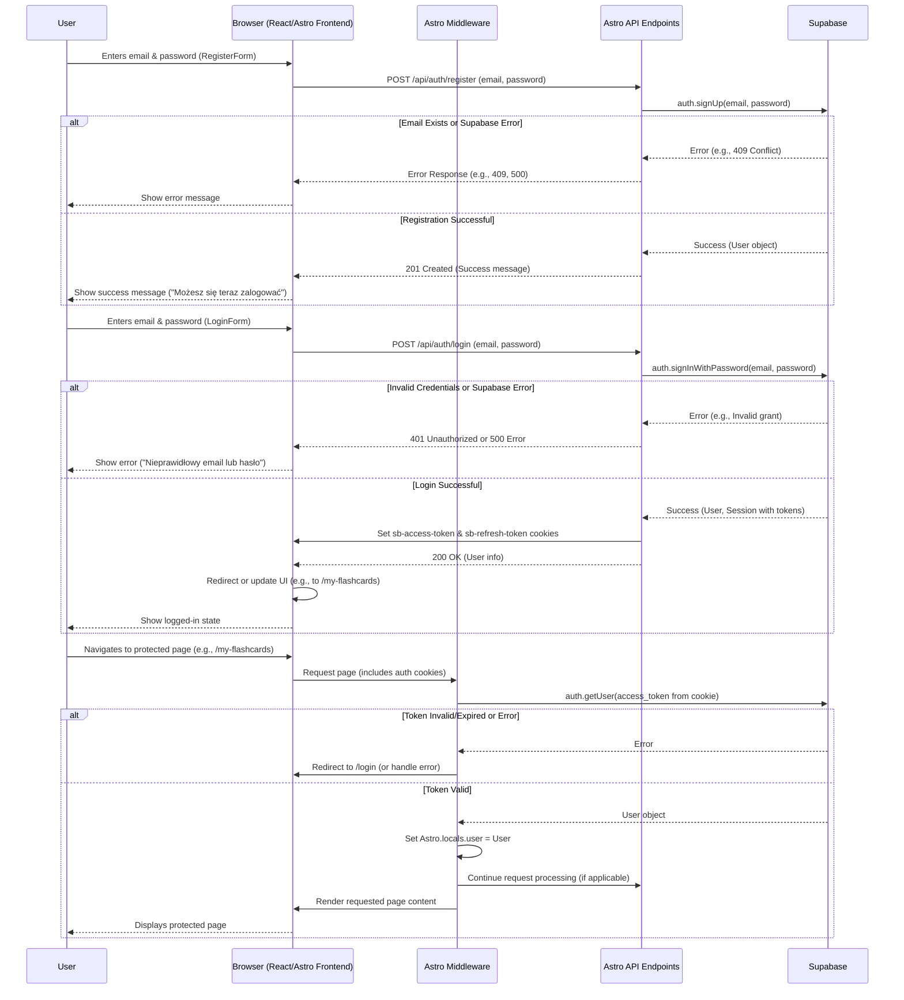

```mermaid
sequenceDiagram
    participant User
    participant Browser as Browser (React/Astro Frontend)
    participant Middleware as Astro Middleware
    participant API as Astro API Endpoints
    participant Supabase

    %% Registration Flow %%
    User->>Browser: Enters email & password (RegisterForm)
    Browser->>API: POST /api/auth/register (email, password)
    API->>Supabase: auth.signUp(email, password)
    alt Email Exists or Supabase Error
        Supabase-->>API: Error (e.g., 409 Conflict)
        API-->>Browser: Error Response (e.g., 409, 500)
        Browser-->>User: Show error message
    else Registration Successful
        Supabase-->>API: Success (User object)
        API-->>Browser: 201 Created (Success message)
        Browser-->>User: Show success message ("Możesz się teraz zalogować")
    end

    %% Login Flow %%
    User->>Browser: Enters email & password (LoginForm)
    Browser->>API: POST /api/auth/login (email, password)
    API->>Supabase: auth.signInWithPassword(email, password)
    alt Invalid Credentials or Supabase Error
        Supabase-->>API: Error (e.g., Invalid grant)
        API-->>Browser: 401 Unauthorized or 500 Error
        Browser-->>User: Show error ("Nieprawidłowy email lub hasło")
    else Login Successful
        Supabase-->>API: Success (User, Session with tokens)
        API->>Browser: Set sb-access-token & sb-refresh-token cookies
        API-->>Browser: 200 OK (User info)
        Browser->>Browser: Redirect or update UI (e.g., to /my-flashcards)
        Browser-->>User: Show logged-in state
    end

    %% Authenticated Request (e.g., loading a page) %%
    User->>Browser: Navigates to protected page (e.g., /my-flashcards)
    Browser->>Middleware: Request page (includes auth cookies)
    Middleware->>Supabase: auth.getUser(access_token from cookie)
    alt Token Invalid/Expired or Error
        Supabase-->>Middleware: Error
        Middleware->>Browser: Redirect to /login (or handle error)
    else Token Valid
        Supabase-->>Middleware: User object
        Middleware->>Middleware: Set Astro.locals.user = User
        Middleware->>API: Continue request processing (if applicable)
        Middleware->>Browser: Render requested page content
        Browser-->>User: Displays protected page
    end
``` 