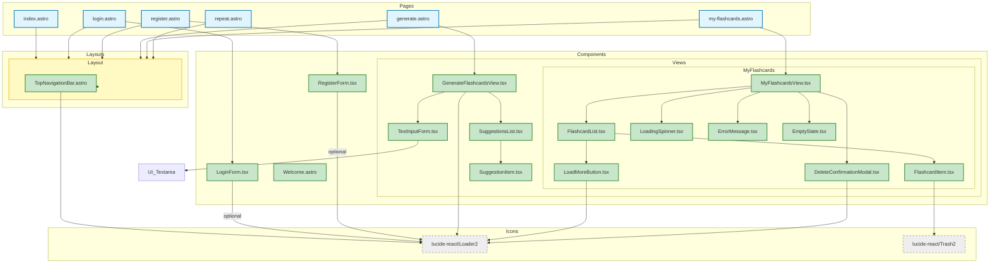

```mermaid
graph TD
    subgraph Pages
        P_Index["index.astro"]
        P_Login["login.astro"]
        P_Register["register.astro"]
        P_Generate["generate.astro"]
        P_MyFlashcards["my-flashcards.astro"]
        P_Repeat["repeat.astro"]
    end

    subgraph Layouts
        Layout["Layout.astro"]
    end

    subgraph Components
        C_Welcome["Welcome.astro"]
        C_LoginForm["LoginForm.tsx"]
        C_RegisterForm["RegisterForm.tsx"]
        subgraph Layout
            CL_TopNav["TopNavigationBar.astro"]
        end
        subgraph Views
            CV_GenFlashcards["GenerateFlashcardsView.tsx"]
            CV_TextInput["TextInputForm.tsx"]
            CV_SuggestionsList["SuggestionsList.tsx"]
            CV_SuggestionItem["SuggestionItem.tsx"]
            subgraph MyFlashcards
              CVMF_MyFlashcardsView["MyFlashcardsView.tsx"]
              CVMF_FlashcardList["FlashcardList.tsx"]
              CVMF_FlashcardItem["FlashcardItem.tsx"]
              CVMF_LoadingSpinner["LoadingSpinner.tsx"]
              CVMF_ErrorMessage["ErrorMessage.tsx"]
              CVMF_EmptyState["EmptyState.tsx"]
              CVMF_DeleteModal["DeleteConfirmationModal.tsx"]
              CVMF_LoadMore["LoadMoreButton.tsx"]
            end
        end
    end

    subgraph Icons
      Icon_Loader["lucide-react/Loader2"]
      Icon_Trash["lucide-react/Trash2"]
    end

    %% Page -> Layout/Component Links
    P_Index --> Layout
    P_Login --> Layout
    P_Register --> Layout
    P_Generate --> Layout
    P_MyFlashcards --> Layout
    P_Repeat --> Layout

    P_Login --> C_LoginForm
    P_Register --> C_RegisterForm
    P_Generate --> CV_GenFlashcards
    P_MyFlashcards --> CVMF_MyFlashcardsView

    %% Layout -> Component Links
    Layout --> CL_TopNav

    %% Component -> Component Links
    CL_TopNav --> Icon_Loader

    C_LoginForm -- optional --> Icon_Loader

    C_RegisterForm -- optional --> Icon_Loader

    CV_GenFlashcards --> CV_TextInput
    CV_GenFlashcards --> CV_SuggestionsList
    CV_GenFlashcards --> Icon_Loader

    CV_TextInput --> UI_Textarea

    CV_SuggestionsList --> CV_SuggestionItem

    CVMF_MyFlashcardsView --> CVMF_LoadingSpinner
    CVMF_MyFlashcardsView --> CVMF_ErrorMessage
    CVMF_MyFlashcardsView --> CVMF_EmptyState
    CVMF_MyFlashcardsView --> CVMF_FlashcardList
    CVMF_MyFlashcardsView --> CVMF_DeleteModal

    CVMF_FlashcardList --> CVMF_FlashcardItem
    CVMF_FlashcardList --> CVMF_LoadMore

    CVMF_FlashcardItem --> Icon_Trash

    CVMF_LoadMore --> Icon_Loader

    CVMF_DeleteModal --> Icon_Loader

    %% Styling
    classDef page fill:#e1f5fe,stroke:#0277bd,stroke-width:2px;
    classDef layout fill:#fff9c4,stroke:#fbc02d,stroke-width:2px;
    classDef component fill:#c8e6c9,stroke:#388e3c,stroke-width:2px;
    classDef icon fill:#eeeeee,stroke:#616161,stroke-width:1px,stroke-dasharray: 5 5;

    class P_Index,P_Login,P_Register,P_Generate,P_MyFlashcards,P_Repeat page;
    class Layout layout;
    class C_Welcome,C_LoginForm,C_RegisterForm,CL_TopNav,CV_GenFlashcards,CV_TextInput,CV_SuggestionsList,CV_SuggestionItem,CVMF_MyFlashcardsView,CVMF_FlashcardList,CVMF_FlashcardItem,CVMF_LoadingSpinner,CVMF_ErrorMessage,CVMF_EmptyState,CVMF_DeleteModal,CVMF_LoadMore component;
    class Icon_Loader,Icon_Trash icon;
```